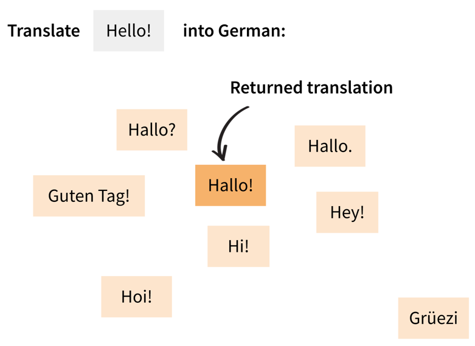

# mbr 🔥

[](https://pypi.python.org/pypi/mbr/)

**mbr** adds Sampling-based Minimum Bayes Risk decoding to [Hugging Face transformers](https://github.com/huggingface/transformers). Originally proposed by [Eikema & Aziz (2022)](https://aclanthology.org/2022.emnlp-main.754/), this technique is a risk-minimizing algorithm for generating text with a language model.

Pronounce: _ember_ /ˈɛm.bɚ/

## Installation

```bash
pip install mbr
```

Requirements:
- Python >= 3.9
- PyTorch

## Usage
The main components of **mbr** are:
- `mbr.MBRGenerationMixin`: overrides a model's `generate` method to add MBR decoding.
- `mbr.MBRGenerationConfig`: specifies the parameters of MBR decoding, e.g., the number of samples to generate and the metric to optimize.

### 1. Load a Hugging Face transformers model
Models need to inherit from `MBRGenerationMixin` for MBR decoding to work. Here's two ways to achieve this, using the Llama model as an example:

**Variant A:**
    
```python
from transformers import LlamaForCausalLM

from mbr import MBRGenerationMixin

class MBRLlamaForCausalLM(MBRGenerationMixin, LlamaForCausalLM):
    pass
```

Then, you can use `MBRLlamaForCausalLM` as you would use `LlamaForCausalLM`:

```python
model = MBRLlamaForCausalLM.from_pretrained(...)
```

**Variant B:**

```python
from mbr import MBR
model = MBR(LlamaForCausalLM).from_pretrained(...)
```

### 2. Configure MBR decoding

Create an `MBRConfig` object to pass to the model's `generate` method:

```python
from mbr import MBRConfig

mbr_config = MBRConfig(
    num_samples=10,
    metric="chrf",
)
```

### 3. Generate text as usual
Call the model's `generate` method directly, or use the Pipeline API. Make sure to pass the `mbr_config`, as well as the model's tokenizer.

```python
from transformers import pipeline

generator = pipeline("text-generation", model=model, tokenizer=tokenizer)
output = generator("Hello,", mbr_config=mbr_config, tokenizer=tokenizer)
```

## How MBR decoding works
The following research papers, among many others, provide a description of Sampling-based Minimum Bayes Risk decoding:
- [Sampling-Based Approximations to Minimum Bayes Risk Decoding for Neural Machine Translation](https://aclanthology.org/2022.emnlp-main.754) (Eikema & Aziz, EMNLP 2022)
- [Understanding the Properties of Minimum Bayes Risk Decoding in Neural Machine Translation](https://aclanthology.org/2021.acl-long.22) (Müller & Sennrich, ACL-IJCNLP 2021)

In practice, MBR decoding is most commonly implemented as follows (on the example of machine translation):

- Instead of searching for the single most probable output sequence (e.g., using beam search), generate a number of samples.
- Score each sample against the other samples using a metric (e.g., BLEU).
- Return the sample with the highest score. Intuitively, this can be seen as returning the median of all samples.




The terminology around MBR decoding varies:

| Term used in this codebase | Alternative terms                                    |
|:---------------------------|:-----------------------------------------------------|
| samples                    | candidates, hypotheses                               |
| references                 | pseudo-references, evidence                          |
| metric score               | expected utility<br/>(negative) expected risk, error |

## Details

### Configuring the sampling
The generation of the samples can be customized by passing a `generation_config` to the `generate` method or to the pipeline call:
    
```python
from transformers import GenerationConfig

generation_config = GenerationConfig.from_pretrained("mymodel",
    do_sample=True,
    num_beams=1,
    epsilon_cutoff=0.02,
)
model.generate(..., generation_config=generation_config)
```

### Separate set of references
By default, the samples themselves are used a references (or a subset of the samples if `num_references` is smaller than `num_samples`).

You could also sample the reference set independently, using a custom generation config for the references:

```python
from transformers import GenerationConfig

references_config = GenerationConfig.from_pretrained("mymodel",
    do_sample=True,
    num_beams=1,
    top_p=0.9,
)
model.generate(..., references_config=references_config)
```

### Choosing a metric
By default, **mbr** integrates metrics via the [Hugging Face Evaluate](https://github.com/huggingface/evaluate) library.

A full list of metrics is found [here](https://huggingface.co/metrics). Some typical choices are:
- [ChrF](https://huggingface.co/spaces/evaluate-metric/chrf) ([Popović, 2015](https://www.aclweb.org/anthology/W15-3049/))
- [COMET](https://huggingface.co/spaces/evaluate-metric/comet) ([Rei et al., 2020](https://aclanthology.org/2020.emnlp-main.213/))
- [BLEURT](https://huggingface.co/spaces/evaluate-metric/bleurt) ([Sellam et al., 2020](https://aclanthology.org/2020.acl-main.704))

In the MBR config, you can either specify the metric's name (e.g., `"chrf"`, `"comet"`) or pass an `evaluate.Metric` object directly.

Since different metrics output differently structured dicts, you need to specify the `metric_output_field` that should be used as the metric score.

```python
from evaluate import load

metric = load('chrf')
mbr_config = MBRGenerationConfig(
    metric=metric,
    metric_output_field="score",  # the ChrF metric returns a dict with a "score" field
    ...
)
```

### Customizing the metric computation
Internally, **mbr** will call the metric's `compute` method to calculate the metric score for each sample.

By default, **mbr** will call `compute` separately for each sample–reference pair.
Since this requires many `compute` calls, it can make sense to optimize the metric computation. Different metrics will require different optimization strategies.
To override the default way of calling the metric, define a `MetricRunner` class and pass it to the `generate` method:

```python
from mbr import MetricRunner

class MyMetricRunner(MetricRunner):

    def __call__(self,
                 input_ids: torch.LongTensor,
                 sample_ids: Tuple[torch.LongTensor],
                 reference_ids: Tuple[torch.LongTensor],
                 ) -> torch.FloatTensor:
        ...  # TODO: implement your efficient metric computation here
        
model.generate(..., metric_runner=MyMetricRunner())
```

For **COMET**, an optimized implementation is already provided in `CometMetricRunner`:

```python
from mbr.metrics.comet import CometMetricRunner

mbr_config = MBRGenerationConfig(
    ...,
    metric="comet",
    metric_output_field="mean_score",
)

metric_runner = CometMetricRunner(mbr_config, tokenizer)
model.generate(..., metric_runner=metric_runner)
```

### Optimizations
MBR decoding is notoriously slow. **mbr** implements some optimizations:
- Cached encoder outputs: For encoder-decoder models, the encoder outputs are computed only once and reused during sampling.
- Cached metric: The metric is computed only once for each unique sample–reference pair (since there will be duplicate samples and references).
- Optimized COMET metric: Inspired by [Amrhein & Sennrich (2022)](https://aclanthology.org/2022.aacl-main.83/), sequence embeddings are cached and reused for all pairwise comparisons.

## Example scripts

The [experiments](experiments) directory contains the code for reproductions of experiments from the following papers:

- [MBR for (low-resource) machine translation](experiments/müller-sennrich-2021-understanding) ([Müller & Sennrich, 2021](https://aclanthology.org/2021.acl-long.22/))
- [MBR with neural metrics and epsilon sampling for machine translation](experiments/freitag-et-al-2023-epsilon) ([Freitag et al., 2023](https://arxiv.org/abs/2305.09860))
- [MBR for summarization](experiments/bertsch-et-al-2023-mbr) ([Bertsch et al., 2023](https://arxiv.org/abs/2310.01387))

## Related projects
- https://github.com/roxot/mbr-nmt: Original implementation ([demo](https://colab.research.google.com/github/probabll/demo-mbr-nmt/blob/main/German-English.ipynb))
- https://github.com/ZurichNLP/understanding-mbr: MBR with Sockeye
- https://github.com/ZurichNLP/mbr-sensitivity and https://github.com/Unbabel/COMET#minimum-bayes-risk-decoding: COMET metric for MBR
- https://github.com/rainavyas/mbr_gec: MBR for Grammatical Error Correction
